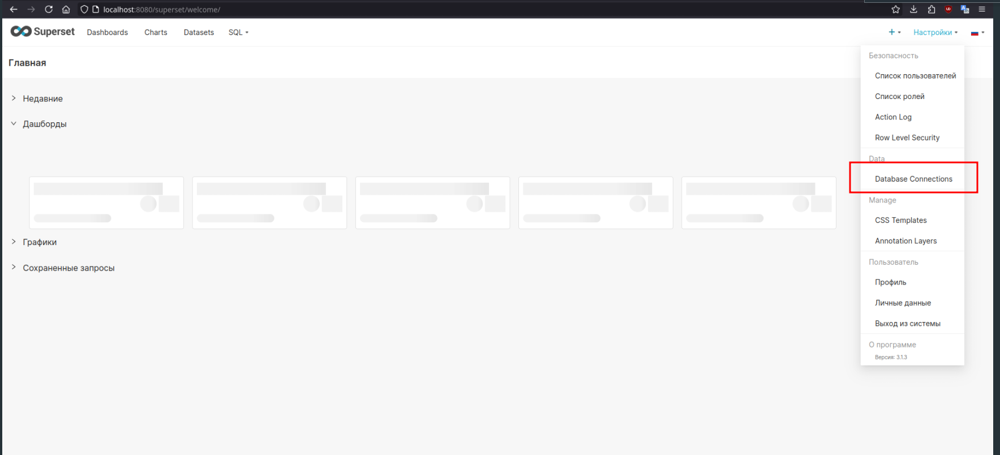
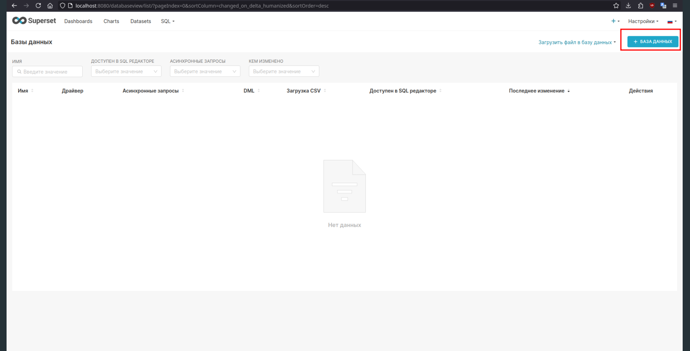
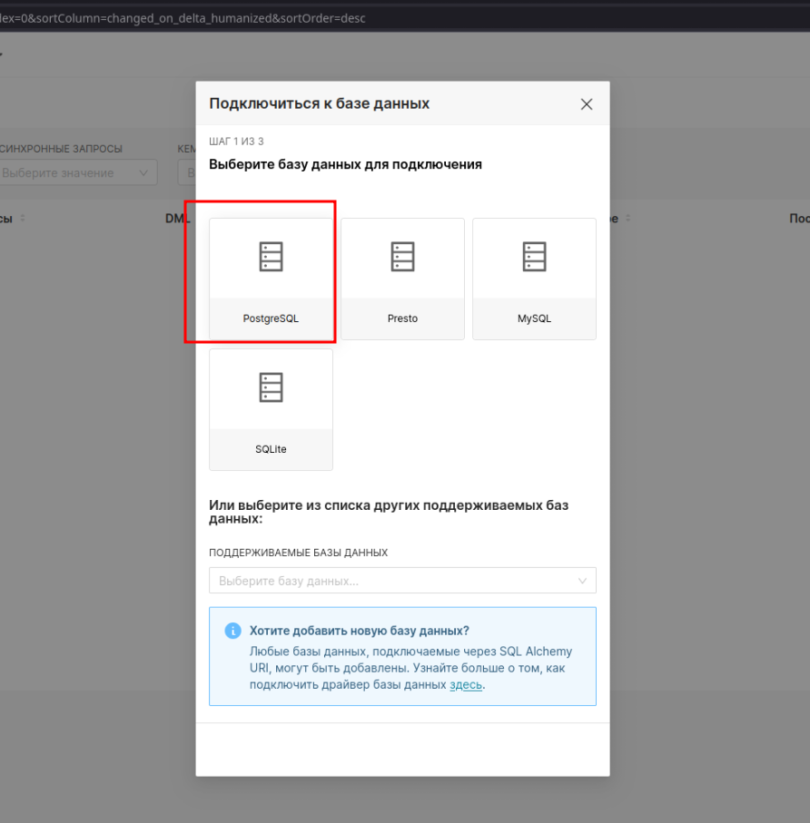
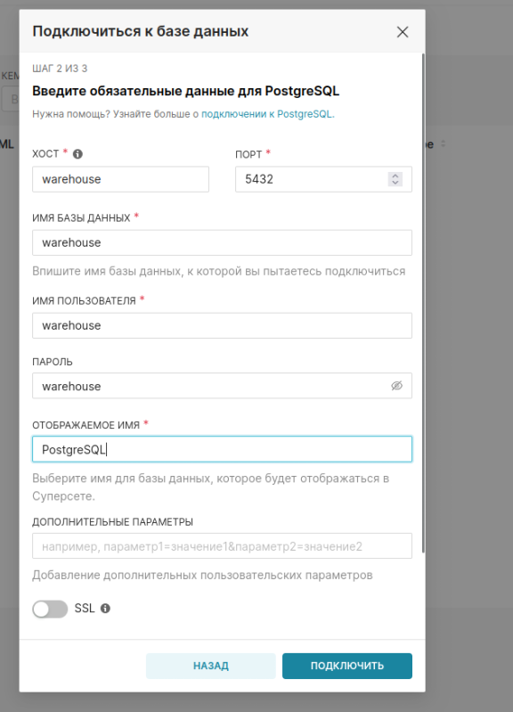
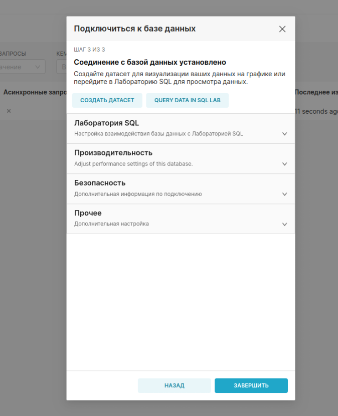
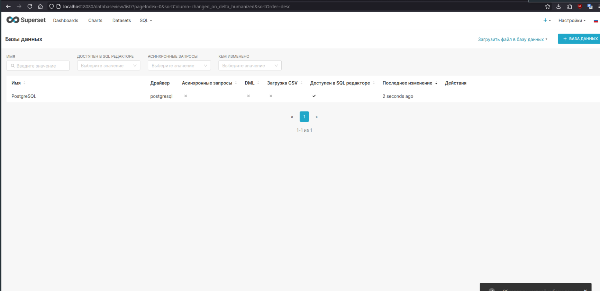

# Visualizer

## Setup

1. Clone or download this repo and change directory to Visualizer

2. Copy Superset's home directory

    `!DO SETUP IN VISUALIZER DIRECTORY!`

    - Create temporary container 

    ```bash
    $ docker run --name temp --detach apache/superset:31e1b63bb3e9f5b3adc289c5580e53d4dcabf277   
    ```
    - Copy directory from container

    ```bash
    $ docker cp temp:/app/superset_home ./superset_home   
    ```

    - Delete temporary container
    ```bash
    $ docker container rm -f temp  
    ```

2. Run Docker Compose
    ```bash
    $ docker compose up -d
    ```

3. Wait until all services are running healthy

    List services
    ```bash
    $ docker compose ps
    ```

    Expected output all services must be healthy, if not list again and wait till they're healthy
    ```bash
    NAME                     IMAGE                  COMMAND                  SERVICE     CREATED          STATUS                    PORTS
    visualizer-pgadmin-1     dpage/pgadmin4:9.1.0   "/entrypoint.sh"         pgadmin     30 minutes ago   Up 30 minutes             443/tcp, 0.0.0.0:5050->80/tcp, [::]:5050->80/tcp
    visualizer-superset-1    visualizer-superset    "/superset-init.sh"      superset    19 minutes ago   Up 19 minutes (healthy)   0.0.0.0:8080->8088/tcp, [::]:8080->8088/tcp
    visualizer-warehouse-1   postgres:13            "docker-entrypoint.s…"   warehouse   30 minutes ago   Up 30 minutes (healthy)   5432/tcp
    ```

## Connect Superset to Warehouse DB
Access superset's WebUI.
1. In the settings press Database Connections
    
    Press Create database connection button
    After that you should see pop-up window
    

2. Choose postgres in pop-up window


3. Configure Connection
Here in hostnames we pass warehouse, because Superset and Warehouse db are in the same dockerc network and Warehouse's hostname is `warehouse`



4. Here you can tinker connection options for you


5. Here's the expected output
