# Visualizer

## Setup

1. Clone or download this repo and change directory to Visualizer

2. Copy Superset's home directory

    `!DO SETUP IN VISUALIZER DIRECTORY!`

    - Create temporary container 

    ```bash
    $ docker run --name temp --detach apache/superset:31e1b63bb3e9f5b3adc289c5580e53d4dcabf277   
    ```
    - Copy directory from container

    ```bash
    $ docker cp temp:/app/superset_home ./superset_home   
    ```

    - Delete temporary container
    ```bash
    $ docker container rm -f temp  
    ```

2. Run Docker Compose
    ```bash
    $ docker compose up -d
    ```

3. Wait until all services are running healthy

    List services
    ```bash
    $ docker compose ps
    ```

    Expected output all services must be healthy, if not list again and wait till they're healthy
    ```bash
    NAME                     IMAGE                  COMMAND                  SERVICE     CREATED          STATUS                    PORTS
    visualizer-pgadmin-1     dpage/pgadmin4:9.1.0   "/entrypoint.sh"         pgadmin     30 minutes ago   Up 30 minutes             443/tcp, 0.0.0.0:5050->80/tcp, [::]:5050->80/tcp
    visualizer-superset-1    visualizer-superset    "/superset-init.sh"      superset    19 minutes ago   Up 19 minutes (healthy)   0.0.0.0:8080->8088/tcp, [::]:8080->8088/tcp
    visualizer-warehouse-1   postgres:13            "docker-entrypoint.s…"   warehouse   30 minutes ago   Up 30 minutes (healthy)   5432/tcp
    ```

## Connect Superset to Warehouse DB
Access superset's WebUI on localhost:8080.
1. In the settings press Database Connections
    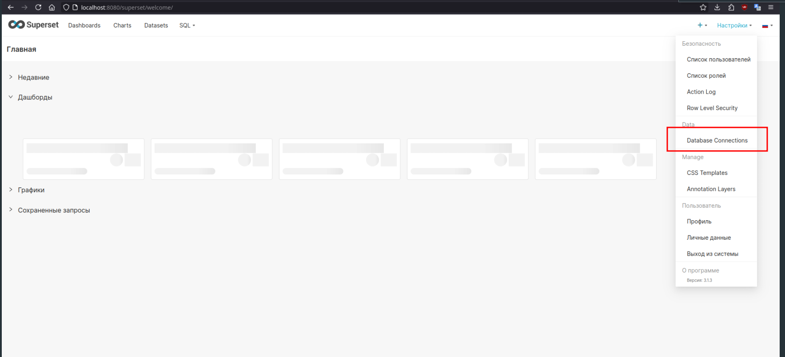
    Press Create database connection button
    After that you should see pop-up window
    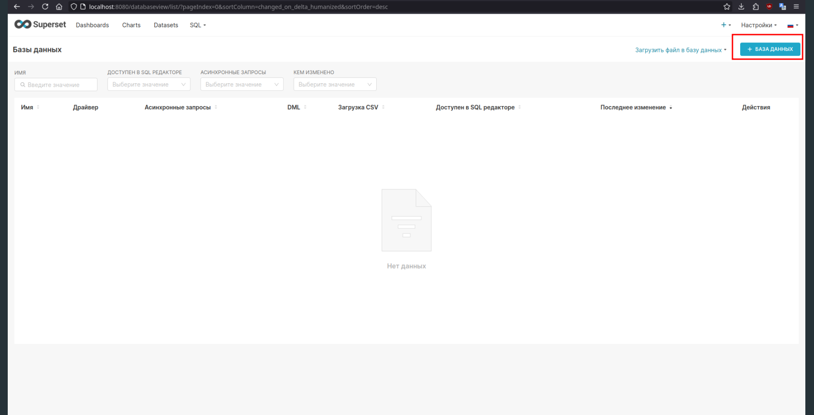

2. Choose postgres in pop-up window
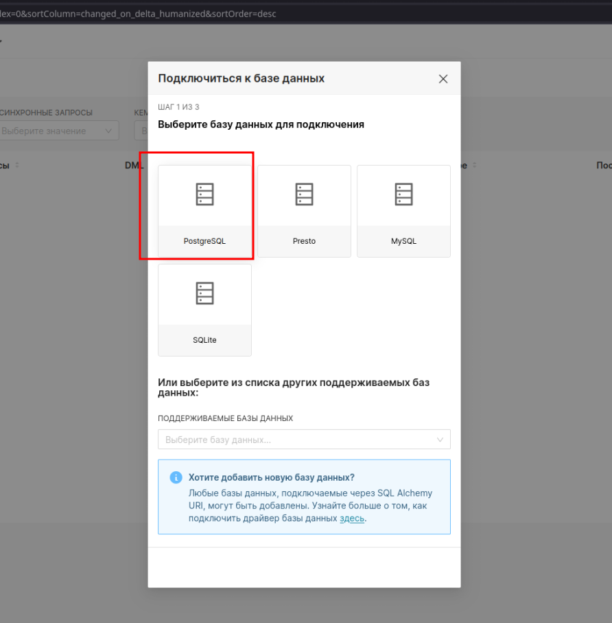

3. Configure Connection
Here in hostnames we pass warehouse, because Superset and Warehouse db are in the same dockerc network and Warehouse's hostname is `warehouse`
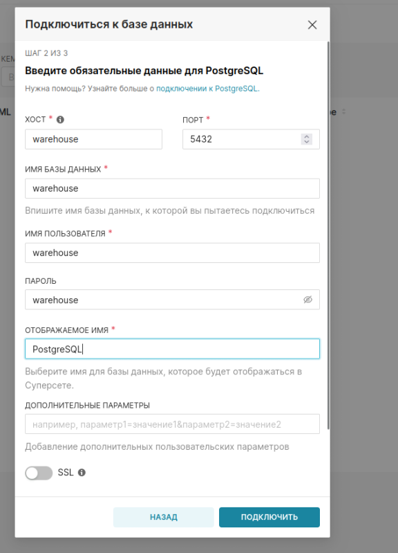


4. Here you can tinker connection options for you
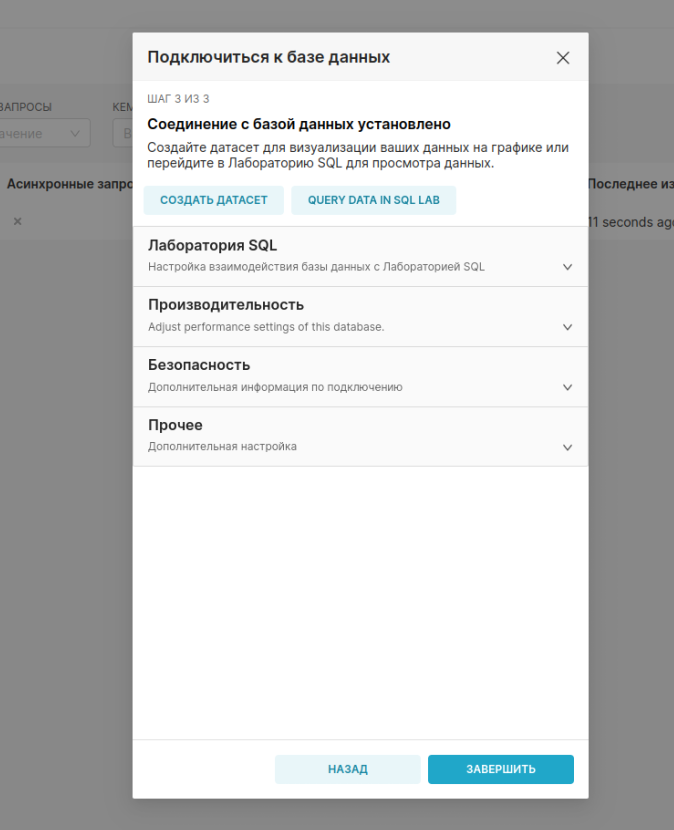

5. Here's the expected output
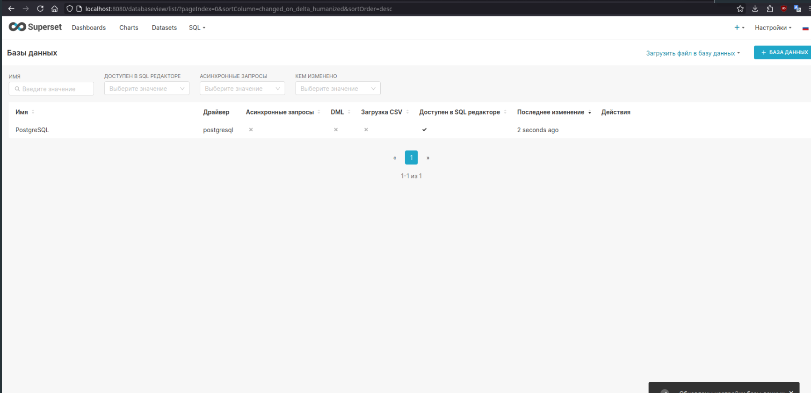

## Connect PGAdmin to Warehouse DB

1. Access PGAdmin WebUI on localhost:5050
    Right click on servers and press register > server
    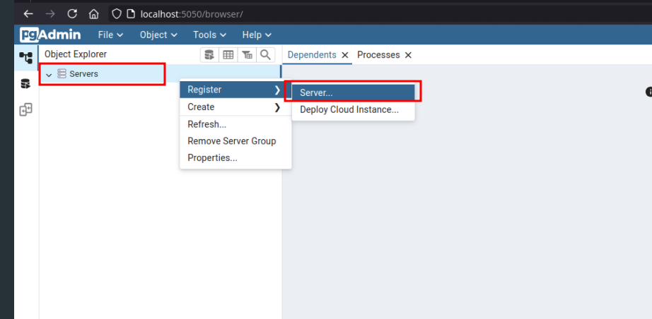

2. Set server name in pop-up window
    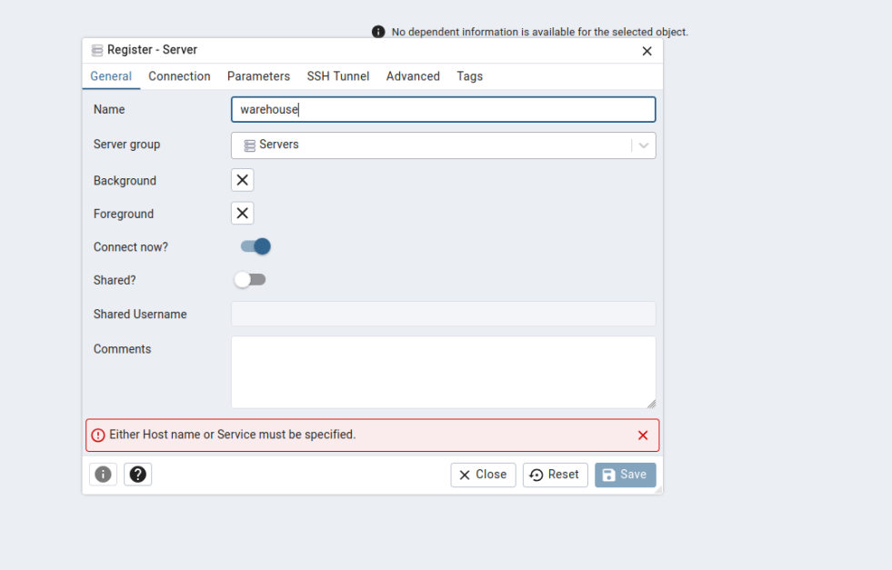

3. Configure connection
    
    just `warehouse` everything

    Here in hostnames we pass warehouse, because Superset and Warehouse db are in the same dockerc network and Warehouse's hostname is `warehouse`
        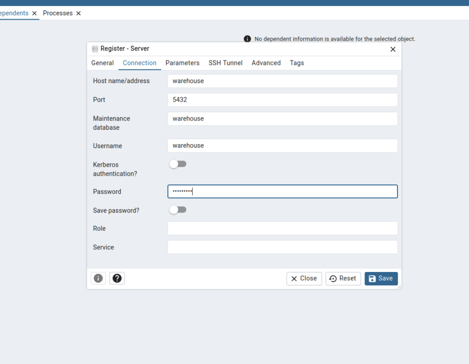

4. Configure connection parameters
    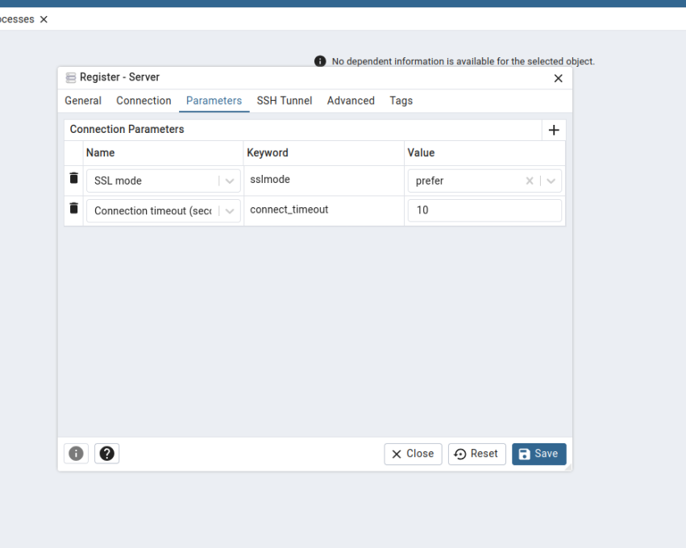
5. Configure ssh tunnel (if you need, otherwise don't touch that)
    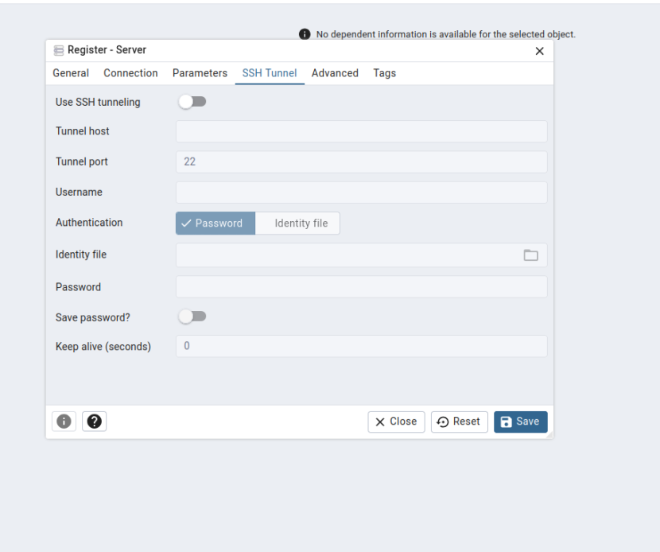
6. Configure advanced settings (if you need)
    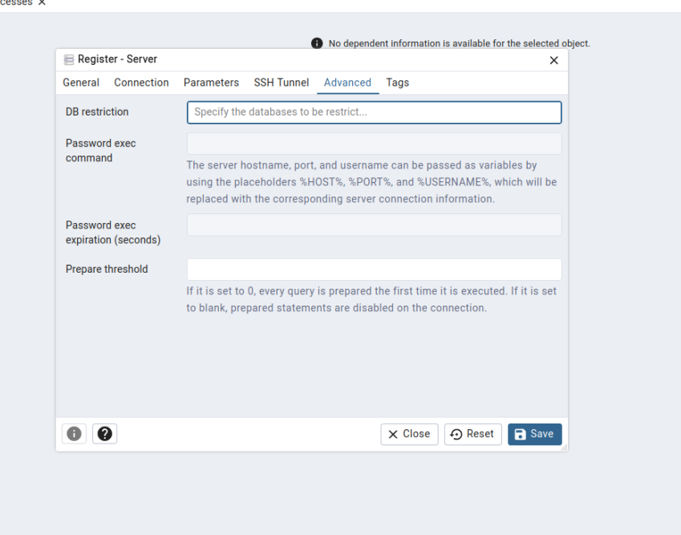
7. Set tags (if you need) and hit save if you finished
    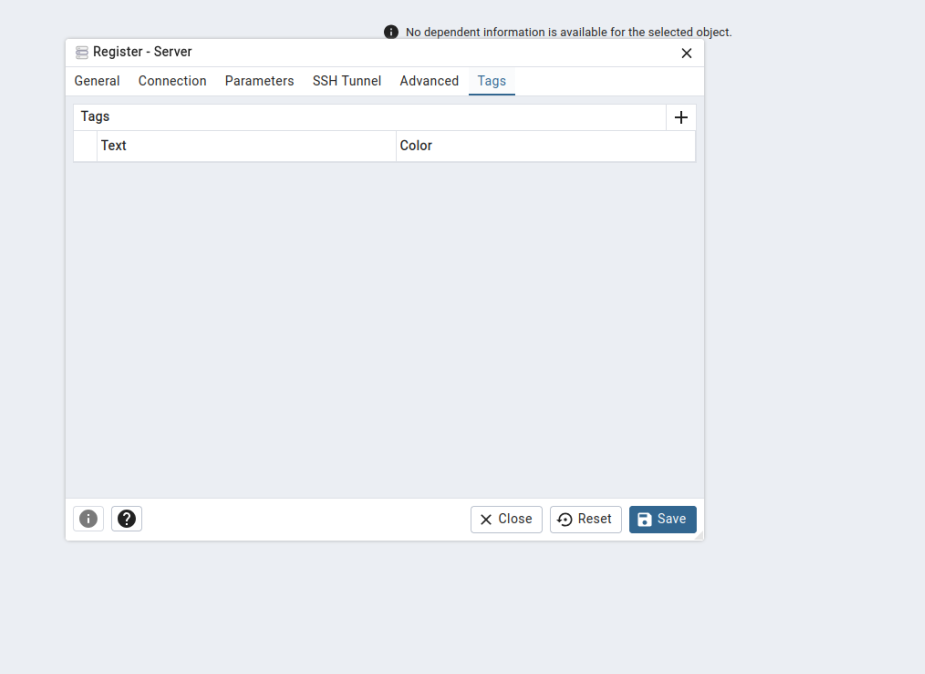
8. Here's the expected output
    
9. Go to query tool workspace and set server that you created
    then hit connect
    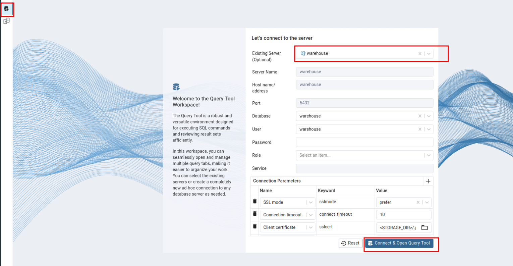
10. Write and execude some sql statements;
    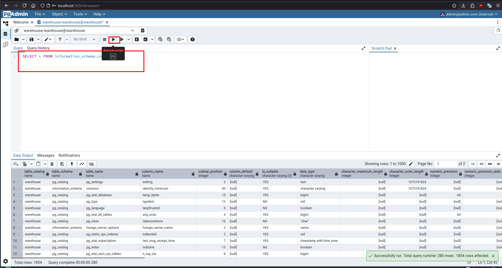